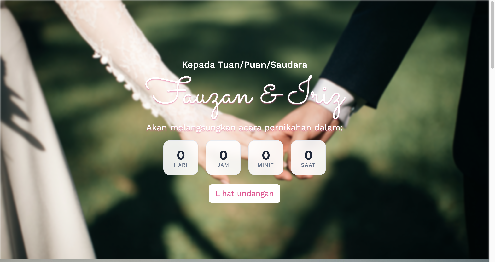
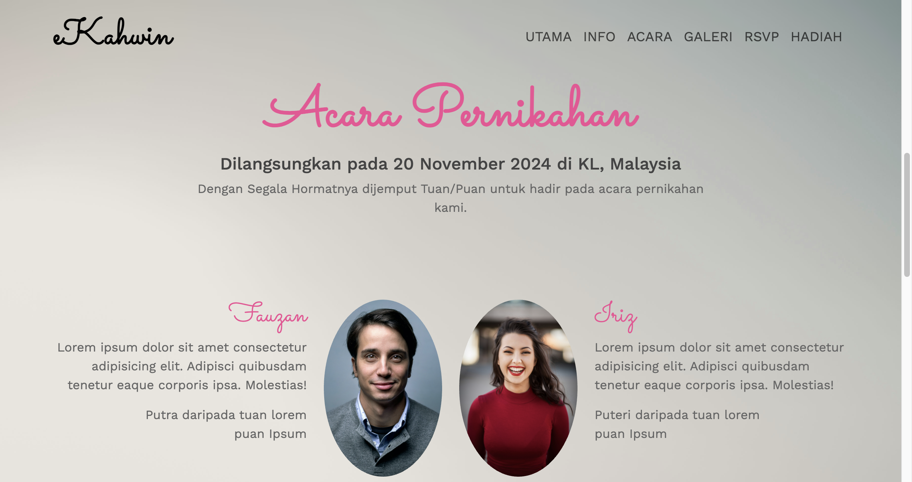

# wedding-page-bootstrap

A responsive wedding invitation website built with Bootstrap 5.

## Features

- **Hero Section** - Welcome message with countdown timer to wedding date
- **Navigation** - Sticky navbar with offcanvas menu for mobile
- **Wedding Info** - Couple introduction with photos
- **Event Details** - Time and location cards with icons
- **Responsive Design** - Mobile-first approach with Bootstrap grid

## Pages

### Page 1a - Hero Section

- Welcome message for guests
- Couple names display
- Countdown timer to wedding date
- "Lihat undangan" (View Invitation) button

### Page 1b - Navigation

- Sticky navbar with brand logo
- Collapsible offcanvas menu for mobile
- Navigation links: Utama, Info, Acara, Galeri, RSVP, Hadiah

### Page 1c - Wedding Details

- Couple introduction section with photos
- Event information cards showing time and location
- Pink color scheme matching wedding theme
